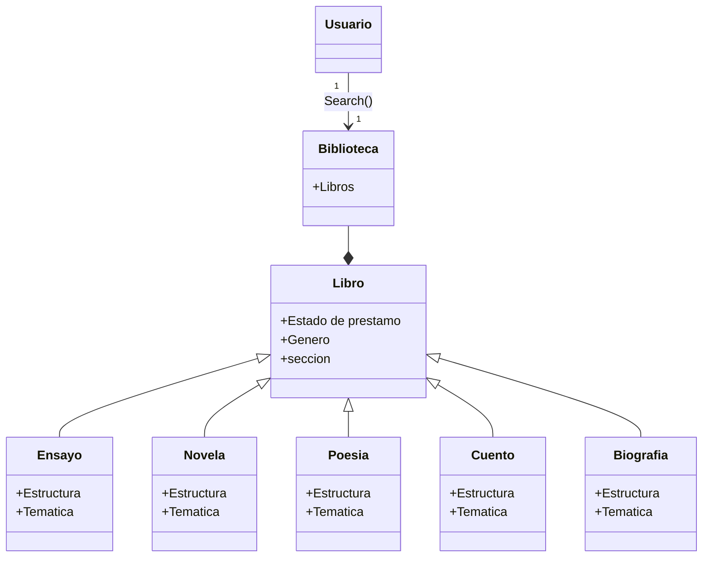

# Reto_2-ServicioBibliotecario

```mermaid
classDiagram
    Usuario"1"-->"1" Biblioteca: Search()
    Biblioteca--*Libro
    Libro <|-- Ensayo
    Libro <|-- Novela
    Libro <|-- Poesia
    Libro <|-- Cuento
    Libro <|-- Biografia

    Libro : +Estado de prestamo
    Libro : +Genero
    Libro : +seccion
    Biblioteca: +Libros


    class Ensayo{
      +Estructura
      +Tematica
    }
    class Cuento{
      +Estructura
      +Tematica
    }
    class Poesia{
      +Estructura
      +Tematica
    }
     
    class Novela{
      +Estructura
      +Tematica
    }
    class Biografia{
      +Estructura
      +Tematica
    }
```
